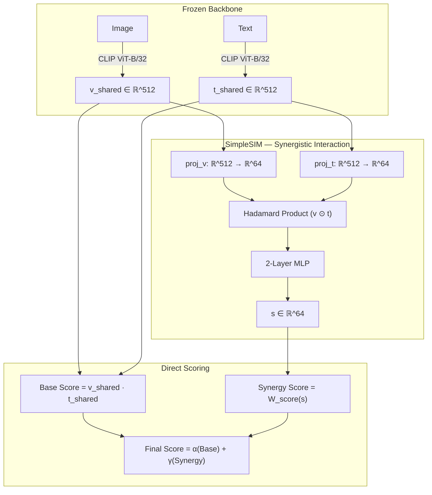

# Simplified SIRA: Synergistic Information-Aware Retrieval Adaptation

This directory contains the **Simplified SIRA** architecture. The core idea is to separate and explicitly leverage **synergistic information** (information emerging only from the joint combination of vision and text modalities) to improve hard negative capabilities in Vision-Language Models.

Unlike the previous iteration, this simplified version strips away unnecessary complexity (no Unimodal Predictors, no Orthogonality losses, no residual clamping, and no LoRA tuning) and operates purely as a direct scoring mechanism.

---

## 📂 Directory Structure

```
Organized_Synergistic/
├── sira/                          # SIRA Core Package
│   ├── simplified_sira.py         # Main SimplifiedSIRA wrapper and SimpleSIM
│   └── __init__.py                # Package exports
├── train_sira_coco.py             # Script to train SimplifiedSIRA on COCO using InfoNCE
├── eval_sira_scpp.py              # Script to evaluate checkpoints on SugarCrepe++
└── README.md                      # This documentation
```

---

## 🚀 Getting Started

### 1. Environment Setup
Activate your virtual environment (if not already active):
```bash
source /home/otw/chisphung/.venv/bin/activate
```

### 2. Training on COCO
We use standard symmetric InfoNCE loss to train the synergistic module on the COCO dataset. The CLIP backbone is kept entirely frozen.

```bash
python train_sira_coco.py \
    --coco-image-root /home/otw/coco/train2017 \
    --coco-ann-file /home/otw/coco/annotations/captions_train2017.json \
    --epochs 10 \
    --batch-size 256
```

Training runs extremely fast since the Simplified SIRA module introduces only ~74K trainable parameters on top of the frozen backbone.

### 3. Evaluating on SugarCrepe++ (SCPP)
SugarCrepe++ measures the model's ability to distinguish positive captions from hard negatives. Our evaluation script automatically loads the dataset and tests your trained checkpoint.

```bash
python eval_sira_scpp.py \
    --scpp-root /home/otw/chisphung/scpp \
    --scpp-image-root /home/otw/chiennhm/data/coco/val2017 \
    --checkpoint ./checkpoints/simplified_sira/simplified_sira_best.pt
```

---

## 🧠 Simplified SIRA Architecture

The Simplified SIRA architecture directly processes features from a frozen CLIP backbone. Instead of complicated residual gates, it relies on a streamlined interaction module (`SimpleSIM`) that extracts synergistic information and projects it directly into a scalar score.



### Module Breakdown

1. **Simple Synergistic Interaction Module (`SimpleSIM`)**:
   Captures cross-modal information by projecting visual and textual features into a synergistic bottleneck (e.g., $d_{synergy} = 64$) and computing their element-wise Hadamard product. A shallow MLP then extracts the synergistic interactions.
   
2. **SimplifiedSIRA Wrapper**:
   Freezes the underlying CLIP model and aggregates the standard dot-product (Base Score) and the synergistic interaction score (Synergy Score).
   $$\text{Final Score}(v, t) = \alpha \cdot (v \cdot t) + \gamma \cdot \text{Score}_{\text{syn}}(v, t)$$
   The scaling parameters $\alpha$ and $\gamma$ are learnable.

3. **Loss Function**:
   Since the architecture directly generates a scalar similarity score between an image and text pair, it is optimized via standard symmetric InfoNCE loss (Cross-Entropy across the batch) without needing supplementary regularization terms like orthogonality.
