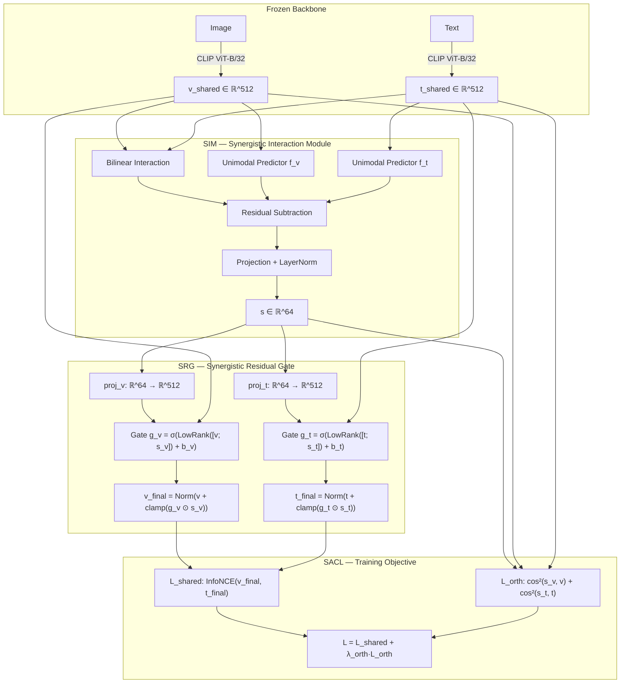

# SIRA: Synergistic Information-Aware Retrieval Adaptation

This directory contains the organized, clean, and modular implementation of the **SIRA (Synergistic-Aware Representation Adapter)** architecture for vision-language retrieval models. 

SIRA introduces a lightweight adapter module to isolate and adaptively fuse **synergistic information** (information emerging only from the joint combination of vision and text modalities) back into unimodal embeddings via learned residual gating.

---

## 📂 Directory Structure

```
Organized_Synergistic/
├── sira/                          # SIRA Core Package
│   ├── sira_model.py              # Main SIRAModel wrapper
│   ├── sim.py                     # Synergistic Interaction Module (SIM)
│   ├── srg.py                     # Synergistic Residual Gate (SRG)
│   └── losses.py                  # Synergistic-Aware Contrastive Loss (SACL)
├── run_scripts/                   # Execution Shell Scripts
│   ├── train_sira_projection.sh   # Train SIRA (unfrozen projections)
│   ├── train_sira_frozen.sh       # Train SIRA (fully frozen CLIP)
│   ├── eval_sira_projection.sh    # Evaluate projection model on HL
│   ├── eval_sira_frozen.sh        # Evaluate frozen model on HL
│   ├── eval_winoground.sh         # Evaluate SIRA on Winoground
│   ├── eval_all.sh                # Run all evaluations immediately (Winoground, HL, Diagnostics)
│   ├── wait_and_eval.sh           # Wait for training PID to complete, then run evaluations
│   └── diagnose_gate.sh           # Run gate diagnostic tool on checkpoint
├── tests/                         # Unit Tests
│   └── test_sira.py               # Modules shape & initialization tests
├── train_sira.py                  # Main SIRA training script
├── eval_hl.py                     # Evaluation script for the HL test set
├── eval_sira_winoground.py        # Evaluation script for Winoground dataset
└── diagnose.py                    # Checkpoint inspection and live gate diagnostic tool
```

---

## 🚀 Getting Started

### 1. Environment Setup
Activate the virtual environment:
```bash
source /home/otw/chisphung/.venv/bin/activate
```

### 2. Running Unit Tests
Validate the SIRA modules initialization, forward pass shape flow, and parameters before starting any training:
```bash
python Organized_Synergistic/tests/test_sira.py
```

### 3. Training SIRA
You can train SIRA using the pre-configured scripts inside `run_scripts/`:
* **With Unfrozen Projections (Recommended)**: Unfreezes CLIP's final projection layers during adapter training.
  ```bash
  ./Organized_Synergistic/run_scripts/train_sira_projection.sh
  ```
* **Fully Frozen CLIP**: Kepps 100% of CLIP backbone weights frozen.
  ```bash
  ./Organized_Synergistic/run_scripts/train_sira_frozen.sh
  ```

### 4. Running Evaluations & Diagnostics
Evaluate trained checkpoints on various benchmarks:
* **All-in-One Evaluation (Immediate)**: Runs Winoground, HL evaluation, and Gate Diagnostics sequentially.
  ```bash
  ./Organized_Synergistic/run_scripts/eval_all.sh [PATH_TO_CHECKPOINT]
  ```
* **Wait and Evaluate**: Useful for queueing evaluations after a background training job (PID) completes.
  ```bash
  ./Organized_Synergistic/run_scripts/wait_and_eval.sh <PID> [PATH_TO_CHECKPOINT]
  ```
* **Specific Evaluations**:
  * HL Dataset Evaluation: `./Organized_Synergistic/run_scripts/eval_sira_projection.sh`
  * Winoground: `./Organized_Synergistic/run_scripts/eval_winoground.sh`
  * Gate Diagnostics: `./Organized_Synergistic/run_scripts/diagnose_gate.sh`

---

## 🧠 SIRA Architecture

SIRA operates as a lightweight adapter on top of a frozen CLIP backbone, adding **<1% trainable parameters** (approximately 404K parameters).



### Module Breakdown

1. **Synergistic Interaction Module (SIM) ([sira/sim.py](file:///home/otw/chisphung/Synergistic/Organized_Synergistic/sira/sim.py))**:
   Approximates the Partial Information Decomposition (PID) framework by extracting the joint vision-text representations and subtracting what each unimodal predictor ($f_v$, $f_t$) can independently infer. What remains is projected to a synergy vector $\mathbf{s} \in \mathbb{R}^{64}$.
   
2. **Synergistic Residual Gate (SRG) ([sira/srg.py](file:///home/otw/chisphung/Synergistic/Organized_Synergistic/sira/srg.py))**:
   Adaptively fusions the synergy vector back to the unimodal embeddings via a low-rank (rank=16) residual gate.
   * **Gate Bias Initialization**: Set to $-2.0$ to ensure gates are initially closed ($\sigma(-2) \approx 0.12$), preventing degradation of pre-trained alignment during initial epochs.
   * **Clamping Constraint**: The synergy injection is mathematically clamped to at most $30\%$ of the unimodal feature norm to maintain retrieval stability.

3. **Synergistic-Aware Contrastive Loss (SACL) ([sira/losses.py](file:///home/otw/chisphung/Synergistic/Organized_Synergistic/sira/losses.py))**:
   Formulates a composite loss:
   $$\mathcal{L} = \mathcal{L}_{\text{shared}} + \lambda_{\text{orth}} \cdot \mathcal{L}_{\text{orth}}$$
   * $\mathcal{L}_{\text{shared}}$: InfoNCE on the final adapted embeddings.
   * $\mathcal{L}_{\text{orth}}$: Orthogonality constraint to prevent the synergy adapter from collapsing into redundant unimodal features.
